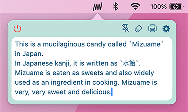
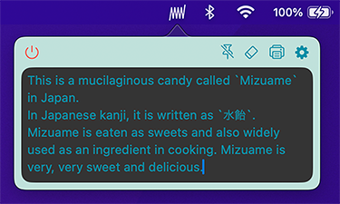

  
  <h1>Mizuame</h1>

The app Mizuame is a note on menu bar of Mac.  
However, this app is NOT a high performance note app so that you should use other better apps to save your important data.  

What is a Good point about the Mizuame?
- It is simple with a few features.
- Quick access from the menu bar.
- Keep your desktop and dock clean.

What is NOT SO GOOD point about the Mizuame?
- You cannot sync data with other devices. (e.g. iPad, Windows)
- This app cannot backup your data, so that your data may be lost unintentionally due to device failure.
- You cannot paste images.

# Website
- Website
  - https://3colorr.github.io/Mizuame-pages/
- Repository
  - https://github.com/3colorr/Mizuame-pages

# Branch
- main
  - Releases.
- Others
  - Development.
  - It likely contain errors.

# Install
- [x] AppStore
  - Search for "Mizuame"
- [x] Build it yourself
  - `git clone` -> Build by Xcode

# Sample

  

    <h4>Light mode</h4>
    
  

  

    <h4>Dark mode</h4>
    
  

# Features
- [x] When you click a icon on menu bar, a note will open.
- [x] Auto save.
- [x] You can resize a note and font.
- [x] You can change theme.
- [x] Printing.
- [x] Pin a note.
- [x] Calculation.(e.g. If you type "(1+2=)", "(1+2= 3 )" will be displayed.)
   - When automatically calculation is performed, the cursor position move to the end of the note. This is one of the issues with this app.

something something.

# What is Mizuame?
This is a mucilaginous candy called `Mizuame` in Japan.  
In Japanese kanji, it is written as `水飴`.  
Mizuame is eaten as sweets and also widely used as an ingredient in cooking. Mizuame is very, very sweet and delicious.
